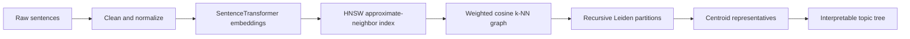
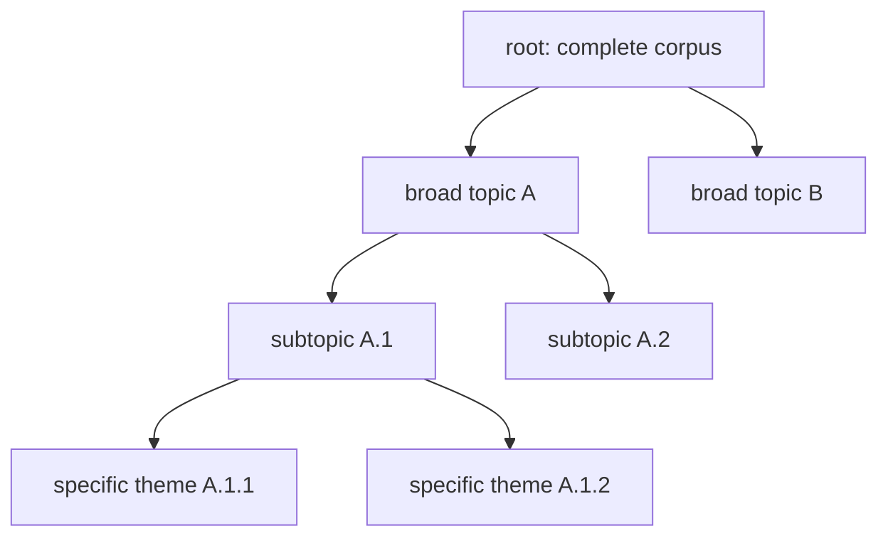

# Leiden AI

Hierarchical semantic clustering for sentence corpora using transformer embeddings,
approximate nearest-neighbor search, and Leiden community detection.

Leiden AI turns an unlabelled collection of sentences into an interpretable topic tree.
It embeds the text, connects semantically similar items in a sparse graph, recursively
partitions that graph, and selects central sentences that describe every cluster.

## Why this project

Flat clustering hides relationships between broad themes and narrow topics. Leiden AI
preserves those relationships as a hierarchy while keeping the expensive similarity
search scalable. The result is useful for corpus exploration, topic discovery, semantic
indexing, and preprocessing for retrieval-augmented generation (RAG) systems.

## Architecture



| Stage | Input | Output | Implementation |
|---|---|---|---|
| Embedding | Clean sentences | Normalized dense vectors | `src/hnsw.py` |
| ANN indexing | Embedding matrix | HNSW index | `src/hnsw.py` |
| Graph construction | Embeddings and index | Weighted undirected graph | `src/knn_graph.py` |
| Community detection | Similarity graph | Recursive cluster tree | `src/leiden.py` |
| Summarization | Tree and embeddings | Representative sentences | `src/cluster.py` |

## Hierarchical output

Each node contains the global indices of its sentences, the resolution at which it was
created, representative sentence indices, and zero or more child clusters.



The hierarchy stops when it reaches `max_depth`, a cluster is smaller than
`min_cluster_size`, its induced graph has no edges, or Leiden cannot produce at least
two children that satisfy `min_child_size`.

## Quick start

This project requires Python 3.13 or newer and uses
[uv](https://docs.astral.sh/uv/) for reproducible dependency management.

```bash
git clone <repository-url>
cd leiden-ai
uv sync
```

Run the pipeline against a JSON file containing a list of sentences. By default, input
files are resolved from `$DATA_DIR/books/datasets` (or
`/home/pierre/projects/data/books/datasets` when `DATA_DIR` is unset).

```bash
export DATA_DIR=/path/to/data
uv run python run_leiden.py corpus.json --device cpu --output topic_hierarchy.json
```

Or call the Python API directly:

```python
from src.cluster import print_tree
from src.hnsw import PipelineConfig
from src.pipeline import run_pipeline

sentences = [
    "Orcas coordinate their movements while hunting.",
    "Dolphins communicate with whistles and clicks.",
    "Eagles circle above mountain valleys.",
]

config = PipelineConfig()
config.embedding.device = "cpu"
result = run_pipeline(sentences, config)
print_tree(result["tree"], result["sentences"])
```

> The default configuration is intended for substantial corpora. For small datasets,
> reduce `k`, `min_cluster_size`, and `min_child_size` so recursive partitions can form.

## Configuration

| Area | Parameter | Default | Purpose |
|---|---|---:|---|
| Embedding | `model_name` | `all-mpnet-base-v2` | SentenceTransformer checkpoint |
| Embedding | `batch_size` | `256` | Texts encoded per inference batch |
| Embedding | `device` | `cuda` | Inference device (`cpu` or `cuda`) |
| HNSW | `k` | `30` | Neighbors queried per sentence |
| HNSW | `M` | `32` | Maximum graph connectivity during indexing |
| HNSW | `ef_construction` | `200` | Build-time accuracy/speed trade-off |
| HNSW | `ef_search` | `100` | Query-time accuracy/speed trade-off |
| Graph | `min_similarity` | `0.25` | Minimum cosine similarity retained as an edge |
| Leiden | `resolution` | `0.5` | Initial community granularity |
| Leiden | `resolution_multiplier` | `1.5` | Granularity increase at deeper levels |
| Leiden | `max_depth` | `5` | Maximum recursive tree depth |
| Leiden | `min_cluster_size` | `50` | Minimum parent size eligible for splitting |
| Leiden | `min_child_size` | `10` | Minimum accepted child-community size |

## Documentation

- [Setup and dependencies](docs/setup.md)
- [Sentence embeddings](docs/sentence-embeddings.md)
- [HNSW approximate nearest neighbors](docs/hnsw.md)
- [Weighted k-nearest-neighbor graph](docs/knn-graph.md)
- [Hierarchical Leiden clustering](docs/hierarchical-leiden.md)
- [Cluster representatives](docs/cluster-representatives.md)
- [Step-by-step animal hierarchy notebook](notebooks/animal_hierarchy_pipeline.ipynb)

## Repository layout

```text
leiden-ai/
├── docs/                   Algorithm and setup guides
├── notebooks/              Reproducible worked example and sample data
├── src/                    Pipeline implementation
├── tests/                  Unit tests
├── run_leiden.py           Command-line entry point
├── pyproject.toml          Project metadata and dependencies
└── uv.lock                 Reproducible dependency lockfile
```

## Quality checks

```bash
uv run --with pytest pytest
uv run pre-commit run --all-files
```

## Limitations and design notes

- Cluster quality depends on the embedding model and the semantic consistency of the
  input corpus.
- HNSW is approximate; higher `ef_construction` and `ef_search` generally improve
  recall at the cost of time and memory.
- Recursive Leiden produces a useful multiscale organization, but it is not a strict
  probabilistic taxonomy and requires dataset-specific parameter tuning.
- Very small or disconnected corpora may remain as a single leaf.

## License

Released under the [MIT License](LICENSE).
