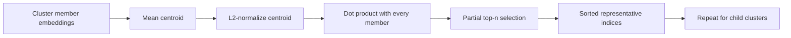

# Cluster representatives

Representative sentences make every cluster interpretable without reading all of its
members. Leiden AI selects the items closest to a cluster centroid in embedding space.

## Algorithm

For cluster member embeddings $x_1, \ldots, x_n$, first compute the mean vector:

$$
c = \frac{1}{n}\sum_{i=1}^{n}x_i.
$$

Normalize the centroid, then score each already-normalized embedding with a dot product:

$$
s_i = x_i^{\mathsf T}\frac{c}{\lVert c \rVert_2}.
$$

The highest-scoring sentences are closest to the semantic center of the cluster.

`numpy.argpartition` finds the top candidates without fully sorting the entire cluster;
only the selected candidates are then sorted by descending similarity.

## Properties and limitations

| Property | Implication |
|---|---|
| Extractive | Every representative is an original sentence; no text is invented |
| Centroid-based | Results favor central language and may omit minority perspectives |
| Recursive | Broad and narrow clusters each receive their own summaries |
| Index-based | Stored indices can be resolved back to source sentences or metadata |

Centroid representatives are best treated as concise examples, not complete labels.
For production use, they can be paired with keyword extraction, metadata aggregation,
or a separately generated cluster title.

## Export and inspection

`print_tree` renders an indented view of the hierarchy. `node_to_dict` converts the tree
to a JSON-compatible structure, and `save_tree` writes that structure to disk. Leaf
nodes include their sentence indices; internal nodes include nested children.

## Implementation

See `add_representatives`, `print_tree`, `node_to_dict`, and `save_tree` in
`src/cluster.py`.

[Back to README](../README.md)
