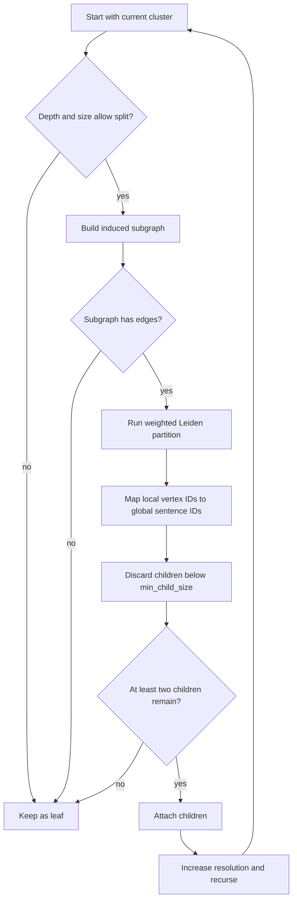

# Hierarchical Leiden clustering

Leiden is a graph community-detection algorithm that optimizes a quality function while
refining communities to improve their internal connectivity. Leiden AI applies it
recursively to produce topics at multiple semantic scales.

## One partition

The implementation uses `RBConfigurationVertexPartition`, a resolution-parameterized
quality function. Conceptually, the algorithm searches for a membership assignment that
rewards strong within-community connections relative to an expected null model.

| Setting | Role |
|---|---|
| Edge `weight` | Makes strong semantic relationships more influential |
| `resolution` | Controls the preferred community granularity |
| `n_iterations` | Limits repeated optimization passes |
| `seed` | Makes randomized optimization reproducible |

Higher resolution generally favors more, smaller communities; lower resolution favors
fewer, broader communities.

## Recursive hierarchy

The root contains every global sentence index. Every recursive call operates on an
induced subgraph, so Leiden returns local vertex positions. These positions are mapped
back through the parent’s index array before child nodes are created.

## Stopping criteria

A branch becomes a leaf when any of the following is true:

1. Its depth reaches `max_depth`.
2. It contains fewer than `min_cluster_size` sentences.
3. Its induced subgraph has no edges.
4. Leiden finds one or zero communities.
5. Filtering by `min_child_size` leaves fewer than two communities.

Filtering can leave some small communities out of the child tree. The parent still
retains its full `indices` array, preserving its complete membership for inspection.

## Interpretation

Recursive community detection is a pragmatic multiscale method rather than a formal
dendrogram. Cluster IDs such as `root.1.0` identify traversal paths; their numeric
components do not encode semantic rank or stability across configuration changes.

## Implementation

See `leiden_partition`, `hierarchical_leiden`, and `_split_cluster` in `src/leiden.py`.

[Back to README](../README.md)
