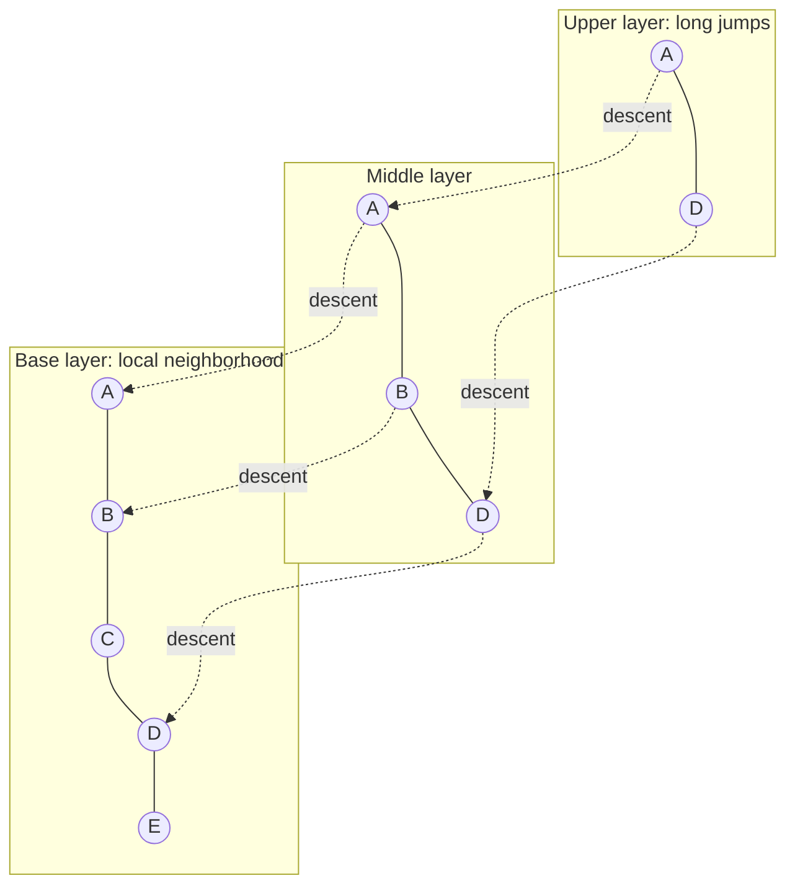

# HNSW approximate nearest neighbors

Hierarchical Navigable Small World (HNSW) graphs provide efficient approximate
nearest-neighbor search in high-dimensional embedding spaces. The index avoids the
quadratic cost of comparing every pair of sentences.

## Intuition

HNSW organizes vectors into graph layers. Sparse upper layers contain long-range links
for rapid navigation; denser lower layers refine the search around promising regions.

Search begins at the highest available layer, greedily approaches the query, and then
descends to increasingly detailed neighborhoods. Leiden AI uses cosine distance, where
`hnswlib` reports

$$
d(x,y) = 1 - \operatorname{cos}(x,y).
$$

## Configuration

| Parameter | Controls | Increasing it generally... |
|---|---|---|
| `M` | Links per indexed element | Improves recall while increasing build time and memory |
| `ef_construction` | Candidate list during index construction | Improves index quality while slowing construction |
| `ef_search` | Candidate list during queries | Improves query recall while slowing queries |
| `k` | Neighbors requested for each sentence | Produces a denser downstream graph |
| `num_threads` | Native worker count | Changes CPU parallelism (`-1` lets the library choose) |

The implementation ensures `ef_search >= k + 1` because each vector normally returns
itself and the graph builder needs `k` non-self candidates.

## Complexity and trade-offs

HNSW offers sublinear approximate queries in typical workloads, but it provides no
universal exact-recall guarantee. Recall, memory, and latency should be measured on the
target corpus. Exact pairwise search may be simpler for tiny datasets.

## Implementation

See `build_hnsw_index` and `HNSWConfig` in `src/hnsw.py`.

[Back to README](../README.md)
