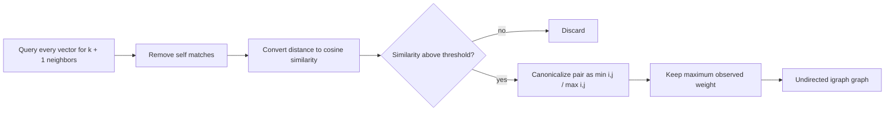

# Weighted k-nearest-neighbor graph

The graph-construction stage converts directional HNSW results into a sparse,
undirected sentence-similarity graph. Each sentence becomes a vertex and each retained
neighbor relationship becomes an edge weighted by cosine similarity.

## Transformation

For every HNSW result with distance $d_{ij}$, the edge weight is

$$
w_{ij} = 1 - d_{ij}.
$$

The edge is retained only when $w_{ij}$ is at least `min_similarity`. Because neighbor
queries are directional, $(i,j)$ and $(j,i)$ can both occur. Canonical keys remove the
duplicate and preserve the strongest observed weight.

## Example

| Query | Neighbor | Cosine similarity | Result |
|---:|---:|---:|---|
| 2 | 7 | 0.82 | Store edge `(2, 7)` with weight `0.82` |
| 7 | 2 | 0.84 | Update edge `(2, 7)` to `0.84` |
| 2 | 9 | 0.18 | Discard when threshold is `0.25` |

## Tuning behavior

- Higher `k` improves connectivity but increases query time, graph memory, and the
  chance of connecting separate semantic themes.
- Higher `min_similarity` creates a cleaner, sparser graph but can isolate valid points.
- Queries are batched to limit temporary memory use; `query_batch_size` does not change
  the intended graph semantics.

If the graph is too dense, Leiden may blur distinct topics. If it is too sparse,
communities can fragment or a cluster may have no edges and stop splitting.

## Implementation

See `build_knn_graph` in `src/knn_graph.py`.

[Back to README](../README.md)
