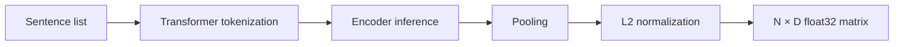

# Sentence embeddings

Sentence embedding maps each input string to a dense numeric vector whose geometry
captures semantic similarity. Leiden AI uses a pretrained `SentenceTransformer` and
returns a float32 matrix with one row per cleaned sentence.

## Process

For a sentence vector $x$, optional L2 normalization computes

$$
\hat{x} = \frac{x}{\lVert x \rVert_2}.
$$

With normalized vectors, cosine similarity reduces to a dot product:

$$
\operatorname{cos}(\hat{x}, \hat{y}) = \hat{x}^{\mathsf T}\hat{y}.
$$

This property is used by the graph and representative-selection stages.

## Configuration

| Parameter | Effect | Tuning guidance |
|---|---|---|
| `model_name` | Controls vector quality, dimensionality, and model size | Match the model to the corpus language and domain |
| `batch_size` | Controls inference throughput and peak memory | Increase until device memory becomes limiting |
| `device` | Selects CPU or CUDA inference | Use CPU for portability and CUDA for large corpora |
| `normalize` | Enables cosine similarity through dot products | Keep enabled for this pipeline |

## Complexity and trade-offs

Transformer inference generally dominates initial runtime. The exact cost depends on
model architecture, token count, corpus size, batch size, and device. Larger models can
improve semantic fidelity but require more memory and compute. Embeddings are cast to
float32 to provide predictable compatibility with `hnswlib`.

## Implementation

See `embed_sentences` and `EmbeddingConfig` in `src/hnsw.py`.

[Back to README](../README.md)
